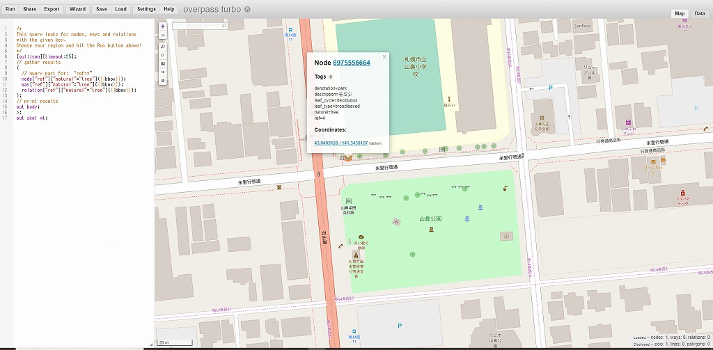

# 2019年度　ゼミ論文　Street-tree-management
江口弥生の2019年ゼミ論制作用レポジトリです

* ゼミ論概論(印刷用アブストラクト)
https://docs.google.com/document/d/1Yn_vw4UU5HdZfArtMzayvN1GafKKmDVPYcaGlpHJDzU/edit?usp=sharing

---

## 住民による街路樹管理支援のためのオープンなGISツールとLocalWikiの活用　
### Utilizing Free and Opensource GIS tool and LocalWiki to support street-tree-management by citizens  
   
## 目次
1. はじめに
2. 方法
3. 成果
4. 課題
5. 結論
6. 参考文献

## 1. はじめに
都市における街路樹は、街の景観向上（シンボルツリー、新芽・花・紅葉などで四季を感じる等）、生活環境の保全（騒音低下、夏の緑陰確保、ヒートアイランド現象の抑制、大気の浄化）、交通安全（歩道と車道の分離、眩しさを遮る）、防災（火事の延焼を防ぐ）などの役割がある。しかし自然界ではなく、道路沿いという環境に植えられた現代の街路樹は、道路標識の視認性確保のためや安全通行のため強剪定されたり、強風・地震・積雪などで倒れ歩行者が人命を奪われたり、交通障害を起こしたりする。また、災害時は避難や救助活動の障害になることもある。日本では住宅開発が進んだ1960年～1980年代に大量に植えられた街路樹が老齢化し、倒木被害などの問題も顕在化しつつある。植えられた街路樹は管理を怠らず日常的な点検・剪定・改善措置などを行い、異常や危険などの問題を回避する必要がある。そのためには、行政だけでなく、住民も日頃から身近な街路樹に対し関心を持ち行政と住民の協働が望まれる。
現在の街路樹管理の問題点として以下の点があげられる。
1. 紙の帳簿で樹木の管理情報を記録し、街路樹をGISを利用したデジタル地図にマッピングしていない自治体が多い。また、街路樹についてオープンデータを提供している自治体は少なく、提供している自治体も樹種とその本数などに限られているものがほとんどである。
2. 樹木医による診断や樹木健全度調査は多大なコストと労力が必要であり、同じ街路樹の診断調査を毎年実施するのはむずかしい。　
3. 異状木に対し住民から街路樹専門に情報提供（苦情等）を受ける方法が確立されていない。スマートフォン用アプリを使用している自治体もある。（例　相模原市の「パッ！撮るん」）しかし、これらアプリは道路全般の障害通報が主目的で街路樹専門ではない。
4. 街路樹管理を担当する職員数の不足。  

上記問題点を解決するため、本研究では誰でも簡単に利用・編集できるOpenStreetMapに街路樹をマッピングし、街路樹の位置情報、属性を共有し、Mapillaryで街路樹の時系列変化を記録、LocalWikiで樹木（特に問題のある樹木）の生育状態の経時的変化を過去の写真も利用しながら観察記録をとり、街路樹管理支援のため住民が使いやすく継続して利用できる方法の構築を試みる。

## 2. 方法
### 2-1 OpenStreetMapにマッピング   
#### [OpenStreetMap](https://ja.wikipedia.org/wiki/%E3%82%AA%E3%83%BC%E3%83%97%E3%83%B3%E3%82%B9%E3%83%88%E3%83%AA%E3%83%BC%E3%83%88%E3%83%9E%E3%83%83%E3%83%97) とは

OpenStreetMapは自由に利用でき、地物の地理情報を自由に編集できる機能を持った世界地図を作る世界的な共同プロジェクトである。提供されたデータはOpen Database License(ODbL)1.0のもと再利用可能である。

#### [Go Map!!](https://wiki.openstreetmap.org/wiki/JA:Go_Map!!)とは

OpenStreetMap内の情報を編集したり新規作成できるiphone用のiOSアプリ。Nodeを素早く登録できるため、フィールドでの個々の街路樹の位置情報登録に使用。

#### 対象街路樹とOpenStreetMapへの入力方法

横浜市都筑土木事務所が2018年度に樹木医により街路樹診断をした樹木を中心に1100本余りの樹木をOpenStreetMapにGo Mapを使用してマッピングした。樹種はケヤキ、クス、ソメイヨシノ、ユリノキ、ヤマザクラ、イチョウ、ハクウンボク、ハナミズキ、アラカシ、サクラ（八重桜）、シラカシ、カツラ、エンジュ、アメリカフウ、こぶし、サルスベリ、シダレザクラ、ナンキンハゼ、メタセコイア、ナツツバキ、モチノキ、ハクモクレン、フジ、不明など25種。サクラは種がはっきりわかるものはヤマザクラ、ヨウコウザクラ、シダレザクラなど分けた。  

 表 1　[OpenStreetMap入力　樹木リスト ](https://docs.google.com/spreadsheets/d/1hhwqPke-wK_2jUdbuTmsoAsKZXQMHUsu_OPeqv2TDDQ/edit?usp=sharing)
 

タグの入力にはOpenStreetMapのtreeのタグづけを参考にdenotation, genus, genus:ja, leaf_cycle, leaf_type, natural, source, species, species:ja, tree:ref, ref のkeyとvalueをわかる限り入力した。

樹木番号は樹木を特定するのに便利である。横浜市都筑土木事務所は樹木診断を受託した会社がつけた番号を利用しているのでそれを樹木番号とし入力した。2018年度に樹木診断されなかった樹木でも、現地調査で過去の樹木診断による樹木番号タグが樹木に付いていたものはそれを入力した。それにより約800の樹木(約72%）の樹木番号を入力できた。
natural=tree の地物でtree:refを使っているケースが143121件, refを使っているケースが199375件あった(2020年1月15日現在)。tree:refのタグは樹木の参照番号とはっきりわかる名称でありドイツや英国など主にヨーロッパで樹木番号として使われている。

図　1 natural=treeと共に使われているタグとその件数  refとtree:refが使われている 

   

図　2　tree:refのタグが使われている場所の地図　

 

図　3　tree:refのタグが使われているドイツのベルリン近くの例

一方、refのタグはNodeだけでも260万件以上の地物に使用されている。あらゆる分野の参照番号やコードに使用され、道路や高速道路の出口番号、学校、郵便ポストなどによく使用される。natural=treeの地物でref タグが使われているケースを一つ札幌で見つけた。natural=treeの地物でref タグが使われているケースの方が件数が多く、将来樹木の管理主体などによりどちらかのtagに一本化されるかもしれないので、今回はtree:ref と ref の両方のタグをつけることにした。

図　4　ref のtaginfo

図　5　natural=tree と ref のタグが使われている札幌の例

図　6  Go Mapのスマホ画面2例

     

### 2-2 Mapillaryで街路樹を撮影
#### [Mapillary](https://www.mapillary.com/)とは

スマホなどで撮影した写真に位置情報を付加し写真共有をするサービスのアプリ。クラウドソーシング方式で世界のあらゆる場所を投稿できるが、最近はほとんどストリートビュー作成に重きを置いている。ライセンスはCC-BY-SA.  

#### 撮影方法
2－1でOpenStreetMapにマッピングした路線を歩行し街路樹をMapillary アプリを使用し撮影しアップロード。時間列変化を見るために半年くらいの間隔で同じ場所を撮影する. 

図　7　MapillaryのPC画面3例  

||
:--------:|:--------:|:--------:
[区役所通りケヤキ街路樹](https://www.mapillary.com/app/?lat=35.55547345321837&lng=139.5769346359655&z=17&focus=map&pKey=WvXJUOZmd1AliIFiLjoiKQ&menu=false)|[池辺歩専(南)2019年4月ヤマザクラ](https://www.mapillary.com/app/?lat=35.53543949320111&lng=139.56374702719563&z=17&focus=map&pKey=Lu9a3VISs_5DxpsOEG60NA)|[池辺歩専(南)2019年11月ヤマザクラ](https://www.mapillary.com/app/?lat=35.53539853081501&lng=139.5637881948311&z=17&focus=map&pKey=HBQifVisGmWRcQtEddsIbA)

### 2-3　LocalWikiで街路樹観察を記録と発信
#### [LocalWiki](https://localwiki.org/) とは

ローカルの知識を草の根で収集・発信・共有・蓄積・継承するためのサーバとその活動を指す。ライセンスはCC-BY 4.0 (Creative Commons Attribution 4.0 license)で誰でも二次利用できる。 背景地図にOpenStreetMapを使用。
カリフォルニアのデービスで2004年[DaisWiki](https://daviswiki.org/)がスタートする。カリフォルニア大学デービス校の学生たちが街の役に立つようなことを考え、住民が記事を書き載せるサイトをつくる。2010年にLocalWikiプロジェクトが始まる。 
日本においては、2012年オープンソースのLocalWikiを使い国土交通省事業として伊豆大島（東京都大島町）が[伊豆大島ジオパーク・データミュージアム](http://oshima.georepublic.jp/Front_Page)というWebサイトを構築した。LocalWikiの背景地図として利用されているOpenStreetMapは島内外からの参加者によるマッピングパーティ開催などで整備された。当初は伊豆大島の観光活性化になる情報を一元化し島内外に発信・共有・蓄積することであった。しかし、2013年10月の台風26号で大被害を受けたとき、地元住民が災害写真を発信したり、Webサイト構築時にかかわったエンジニアやマッパーなどの人的ネットワークにより被災状況や危険個所区域の情報を集約した伊豆大島台風被災状況マップがつくられた。

図　8　伊豆大島ジオパーク・データミュージアムの台風26号災害写真と記事の投稿
  

図　9　伊豆大島台風被災状況マップ

伊豆大島ジオパーク・データミュージアムのLocalWikiは観光を軸にデータを蓄積しつつ背景地図のOpenStreetMapを整備することで防災にも活用できる情報共有のプラットフォームとなった事例である。

2014年8月に[Knight Foundation](https://knightfoundation.org/)が支援を始め、日本語化も含めて無料のサーバが提供される。2014年12月に[LocalWiki Organization Japan(LoJ)](https://ja.localwiki.org/main-ja/)が設立される。2015年にLocalWikiは正式にグローバル化、多言語化された。LocalWikiはこのようにシステムの変更を経ながら、Local=地元の知識・想いを草の根で収集・発信・共有し、それを蓄積して継承するツールとして日本各地で使われている。その中で[室蘭](https://ja.localwiki.org/mr/)は活動的リージョンである。
LocalWikiは今回の研究目的と合致し、PCだけでなくスマホからも入力できる携帯性、データ格納量からも街路樹観察記録に適するので使用する。

#### LocalWikiの対象街路樹・対象場所・記録方法
2-1と2-2では1100本余りの樹木を入力し,　ストリートビュー的に街路樹の写真撮影をしたが、LocalWikiには日本人が愛着を感じる樹木で,　毎年住民が花見を楽しみにし、良好な生育状態を維持するために個々の樹木の観察管理が重要なサクラを対象街路樹にし、対象場所は池辺歩専道（北側）と池辺歩専道（南側）の80本あまりを対象としLocalWikiの横浜市都筑区内に[都筑の樹木のページ](https://ja.localwiki.org/yokohama/tags/%E9%83%BD%E7%AD%91%E3%81%AE%E6%A8%B9%E6%9C%A8)を作成した。　

LocalWikiの都筑の樹木の各ページを見た人が問題樹木に速やかに気が付くように、観察する全てのサクラの木の状況を毎回アップロードしていく方法ではなく、観察したサクラの中から問題がある樹木の写真とコメントをアップロードする方法をとった。また過去に撮影したサクラの開花の写真などもアップロードし経年変化を示した。サクラの写真のキャプション内に樹木番号表示をし、OpenStreetMap上の樹木位置のサイトとリンクをはり、当該樹木の位置が確認できるようにした。

図　10　LocalWikiのスマホ画面  3例  

      

図　11　LocalWikiのPC画面例  

  

### 3. 成果
本研究は横浜市都筑区内の街路樹1100本あまりをOpenStreetMapにマッピングし、街路樹の時系列変化を見るためにMapillaryを使用し、樹木の健全性を住民が観察し発信するためにサクラを例にLocalWikiを使用するという統合的に運用する方法を提案した。OpenStreetMap上に樹木番号付きの樹木マッピングをすることにより行政と住民が樹木の位置情報など基本情報を共有できた。　行政は現地に足を運ばなくてもLocalWikiを通じ問題樹木の状況を知ることができた。行政と住民が問題のある樹木の改善措置などを話し合う時にLocalWikiを通じ樹木状況の情報が共有されているのでコミュニケーションがスムーズになる。この統合方法は地域の街路樹維持管理ばかりでなく、将来的な街路樹計画の策定や、住民参加のまちづくりにも役立つと思われる。　　

街路樹や道路全般の障害を自治体に知らせるスマホアプリとLocalWikiを利用した観察記録を比較すると、観察記録は一過性でないため日頃の手入れなど樹木管理の改善措置をとる際に有効に活用できると思われる。、

### 4. 課題
*本研究で使用したMapillaryは街路樹の外観風景をストリートビュー的に時系列で記録するには良いアプリであるが、樹木観察用のアプリではない。街路樹管理という観点から目的にふさわしい記録がとれるアプリかどうか時間をかけて検証すると同時に、より良いアプリがあるか探し続ける必要がある。  

*LocalWikiのスマホ入力ではリンクを貼る機能を使えなかった。またさらに使い易くするために樹木観察用のスマホ入力Templateを作成することが望ましい。  

*この統合的方法を改善したり推進するには地域の樹木に関心のある住民や緑化推進ボランティアグループなどにマッピングパーティやウォークショップを開く必要がある。  

*本研究では観察樹種でサクラを扱ったが、他のどの樹種だったら住民が関心を持ちLocalWikiで観察記録を発信できるか調査することが望ましい。

*観察記録という観点では突発的な事故時と四季の変化が認められる３か月おきくらいに樹木が観察され発信されることが望ましい。

### 5. 結論
本研究では行政と住民の協働が望まれる街路樹管理において、住民が使いやすく継続して利用できる方法として既存の無料ツールを統合的運用する方法を提案した。オープンソース化により行政と住民が情報共有でき、その有効性が確認できた。　しかし、本研究ではウォークショップなどを開くところまではできなかった。Mapillaryが樹木管理に最適なアプリかどうかや、アプリの使いやすさ改善のために、今後さらに検証する必要がある。

### 6. [参考文献](https://docs.google.com/spreadsheets/d/1ZDFHT-tS0JYU_xqXpMTEAbWzD7e3jMAxkw7V6gYpmtg/edit#gid=1750012034)：

1.[国土交通省　国土技術政策総合研究所　研究資料　別冊第１編　街路樹の点検・診断](http://www.nilim.go.jp/lab/bcg/siryou/tnn/tnn1059pdf/Ks1059018.pdf)　　

2.[国土交通省　国土技術政策総合研究所　研究資料　第２編　街路樹の点検・診断事例集](http://www.nilim.go.jp/lab/bcg/siryou/tnn/tnn1059pdf/Ks1059013.pdf)　　

3.[環境省　街路樹ケース検討のための事前調査-ヒートアイランド現象に対する適応検討調査業務](https://www.env.go.jp/air/report/h23-01/04-ref2-3.pdf)  

4.[タブレット端末を利用した植物学習と樹木管理のためのサクラ属のデータベース(CerasusDB)の開発　中村彰宏、守村敦郎](https://www.jstage.jst.go.jp/article/jjsrt/43/1/43_174/_article/-char/ja/)  

5.[相模原市道路通報アプリ「パッ！撮るん」](http://www.city.sagamihara.kanagawa.jp/patrun/)  

6.[樹木医](http://www.jpgreen.or.jp/treedoctor/info.html)  

7.[野田市街路樹管理マニュアル　素案](https://www.city.noda.chiba.jp/_res/projects/default_project/_page_/001/010/216/gairozyuizi.pdf)

8.[浦安市街路樹マップ（オープンデータ）](http://www.city.urayasu.lg.jp/shisei/keikaku/1022110/1025892/1025896/1022352.html)

9.[北九州市　街路樹樹種別本数](https://ckan.open-governmentdata.org/dataset/401005_gairojyujyusyubetsuhonsu)

10.[オープンストリートマップ](https://ja.wikipedia.org/wiki/%E3%82%AA%E3%83%BC%E3%83%97%E3%83%B3%E3%82%B9%E3%83%88%E3%83%AA%E3%83%BC%E3%83%88%E3%83%9E%E3%83%83%E3%83%97)

11.[JA:Go Map!!](https://wiki.openstreetmap.org/wiki/JA:Go_Map!!)

12.[JA:Tag:natural=tree](https://wiki.openstreetmap.org/wiki/JA:Tag:natural%3Dtree) 

13.[Taginfo ref](https://taginfo.openstreetmap.org/keys/tree%3Aref)

14.[Taginfo natural=treeと共に最も使われているタグ](https://taginfo.openstreetmap.org/tags/natural=tree#combinations)

15.[Taginfo tree:ref](https://taginfo.openstreetmap.org/keys/tree%3Aref)

16.[Mapillary](https://www.mapillary.com/)

17.[LocalWiki](https://localwiki.org/about/)

18.[DavisWiki](https://localwiki.org/davis/)

19.[Knight Foundation](https://knightfoundation.org/about/)

20.[国土交通省　国土政策局　地域づくり活動に地図やGISを使おう～地理空間情報(G空間情報）の活用事例と手引き～](http://www.mlit.go.jp/common/001035477.pdf)

21.[クラウドソーシングとフィールドワークに基づく農山漁村の地理空間情報の共有　瀬戸寿一](https://www.jstage.jst.go.jp/article/arp/33/1/33_41/_article/-char/ja/)

22.[伊豆大島ジオパーク・データミュージアム　台風26号泉津地区崩落個所](http://oshima.georepublic.jp/2013%E5%8F%B0%E9%A2%A826%E5%8F%B7%E6%B3%89%E6%B4%A5%E5%9C%B0%E5%8C%BA%E5%B4%A9%E8%90%BD%E5%80%8B%E6%89%80)

23.[伊豆大島ジオパーク・データミュージアム　2013.10.16土砂災害](http://oshima.georepublic.jp/2013.10.16%E5%9C%9F%E7%A0%82%E7%81%BD%E5%AE%B3)

24.[伊豆大島台風26号被災状況マップ](https://izuoshima26.crowdmap.com/)

25.[LocalWiki Organization Japan Guide(Japan)](https://ja.localwiki.org/main-ja/)

26.[室蘭Wiki](https://ja.localwiki.org/mr/)

